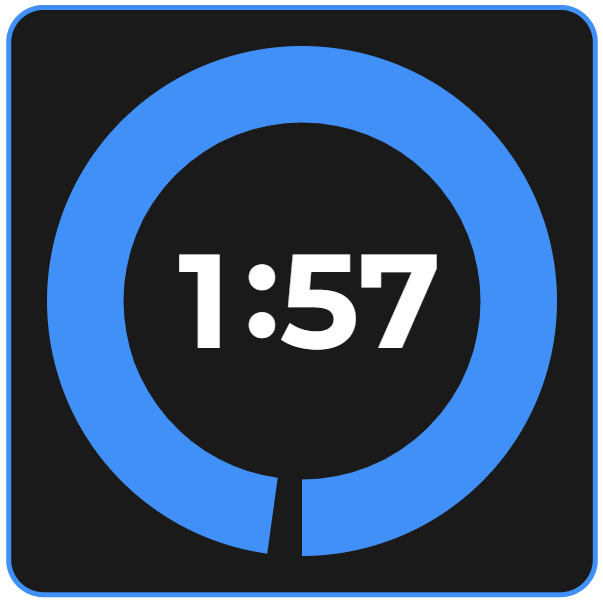

# ChzzkCount
Count for Chzzk

### 개발 목적
- 이 프로그램은 치지직 방송 하시는 분들을 위해 공개한 오픈 프로젝트 입니다.

### 기능 설명
- 스트리머 계정으로 아래에 소개하고 있는 명령어를 입력하면 채팅을 읽고 해당 기능을 수행합니다.
- 아래의 명령어를 통해 카운트 다운을 애니메이션으로 보여주는 프로그램 입니다.

### 라이선스
- 이 프로젝트는 소스를 공개한 오픈 소스 프로젝트(Open Source Project) 입니다.
- 이 프로젝트는 [CC BY-NC 한글](https://creativecommons.org/licenses/by-nc/4.0/deed.ko), [CC BY-NC English](https://creativecommons.org/licenses/by-nc/4.0/) 를 따릅니다. 누구나 무료로 이용할 수 있지만, 상업적으로 사용해선 안됩니다.
- 방송을 하면서 수익활동(후원등)을 하지 말라는 이야기가 아닙니다. 이 프로그램을 판매 하는 행위만 하지 않고 얼마든지 무료로 이용하시면 됩니다.

### 사용 방법
- https://minisv.github.io/ChzzkCount/?chzzk=
- 위의 주소 chzzk= 뒤 부분에 여러분의 방송 chatChannelID 를 입력 합니다.

### chatChannelID 알아오는 방법
- 예를 들어, https://chzzk.naver.com/769788af1e0d5fc7caeeb025504e62d8 채널주소가 이와 같다면? 76으로 시작하는 긴 값이 여러분의 채널 아이디 값이 됩니다.
- https://api.chzzk.naver.com/polling/v2/channels/(여러분의채널아이디값)/live-status 로 접속하면 chatChannelID 뒤의 값이 나옵니다. 여러분의 채널 아이디 값을 대입하여 확인해 주세요.
- 크롬창에서 보실 때의 화면에선 보기 힘들 수 있으니 "pretty print 적용" 을 체크 해 주시면 깔끔하게 보실 수 있어요.
- 위의 값을 대입하면 저의 경우는 "chatChannelId": "N1nO-6" 로 확인이 됩니다.
- 해당 값을 사용 방법에서 안내한 주소 처럼 ?chzzk=chatChannelID 로 셋팅 하면 됩니다.
- 그렇다면 제가 사용해야 하는 주소는 https://minisv.github.io/ChzzkCount/?chzzk=N1nO-6 가 됩니다.
- 방송하시는 분들 마다 채널ID 가 다 다르고, 방송의 채팅에 사용되는 chatChannelId 가 다 다르기 때문에 위의 과정을 꼭 거쳐주셔야 합니다.
- 19금 방송의 경우 chatChannelId 를 알아온다고 해도 네이버에 인증값을 넘기지 않으면 채팅을 가져올 수 없습니다.
- 이 프로그램은 채팅 인증 기능을 지원하지 않습니다. 해당 기능이 필요하신분은 와우봇이나 기타 다른 프로그램을 이용해주세요.

### OBS 연동 방법
- OBS 소스 목록에서 아래 + 버튼을 누르고 "브라우저" 를 눌러서 추가해주세요.
- 적당히 이름을 지어주고, URL 에 위의 chatChannelID 알아오는 방법을 통해 얻은 값을 https://minisv.github.io/ChzzkCount/?chzzk= 뒤에 공백없이 붙여넣어주세요.
- 너비 600 높이 600 을 설정해 주시고 잘 나오는지 확인 하시면 됩니다. (초기 입력만 600 X 600 으로 하시고 빨간 사각형으로 크기 조절 하시면 됩니다.)

### 주의 사항
- 19금 방송이 체크된 경우 데이터를 확인 할 수 없습니다.
- 19금 방송의 경우는 채팅에 인증된 아이디로 로그인 해야 하는 방식이므로, 로그인 과정이 생략된 이 방법으로는 데이터를 활용할 수 없습니다.
- 위의 chatChannelID 값은 19금 방송일 때와 19금 방송이 아닐때 각기 다른 채팅 채널값을 얻어오게 됩니다. 이용에 주의해주세요.
- 와우봇 처럼 계정 인증을 통하여 채팅 채널에 로그인 한 것이 아니므로 자동으로 채팅에 남은 시간 알림 등 와우봇 고유기능을 사용할 수 없습니다.
- 더욱 확장된 기능을 사용하고 싶으시다면 계정 인증을 통한 프로그램을 사용해주세요.
- 이 프로그램은 치지직의 사정으로 방송 채팅 채널 연결 방법 변경 등으로 사용이 중지된 경우에는 사용할 수 없습니다.

### 명령어 안내
- 치지직 채팅에서 입력해주세요.
- 스트리머 본인 계정으로만 사용 가능합니다.
- /카운트 30 : 30초간 카운트를 시작 합니다.
- /카운트 3분 : 3분간 카운트를 시작 합니다. 기존에 카운트중이었다면 기존 것을 취소하고 새로 카운트 됩니다.
- /카운트취소 : 현재 진행중인 카운트를 취소 합니다.

### 일러스트 안내
- 프로그램 내의 일러스트는 치지직에서 방송하고 계신 [모미지예요](https://chzzk.naver.com/5eb126cea465f411843cdc2074ebb301)님이 그려주셨습니다. 
- 방송에 고맙다고 인사, 응원 및 팔로우 해주세요.

### 음성 안내
- 프로그램 내의 음성은 치지직에서 방송하고 계신 [뜌미](https://chzzk.naver.com/016e9a8b19018ef5c83246a0343fe32e)님이 녹음해주셨습니다. 
- 방송에 고맙다고 인사, 응원 및 팔로우 해주세요.
- 와우봇에서는 조금 더 많은 음성으로 이용하실 수 있습니다.

### 와우봇 소개
- 이 프로젝트는 와우봇 개발중 일부 프로그램을 공개형으로 전환한 것 입니다.
- 와우봇은 방송을 좀 더 재밌고 쉽게 할 수 있도록 도와주는 프로그램 입니다.
- 와우봇에서는 조금 더 많은 기능들을 만나보실 수 있습니다.

### 궁금한점은?
- 디스코드 minirune 으로 친구요청 하시고 문의 하여 주시기 바랍니다.
- 친구요청 하실때엔 치지직 방송채널 링크도 함께 보내주시면 더 좋겠습니다.

### 마무리 글
- 이 프로그램은 [미니룬](https://chzzk.naver.com/769788af1e0d5fc7caeeb025504e62d8)이 개발하였습니다. 기능 테스트에 필요하니 팔로우 부탁드려요. 고맙습니다.